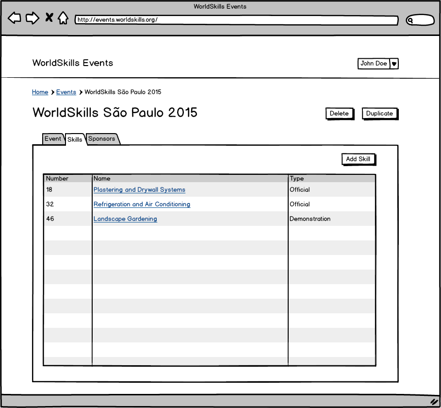
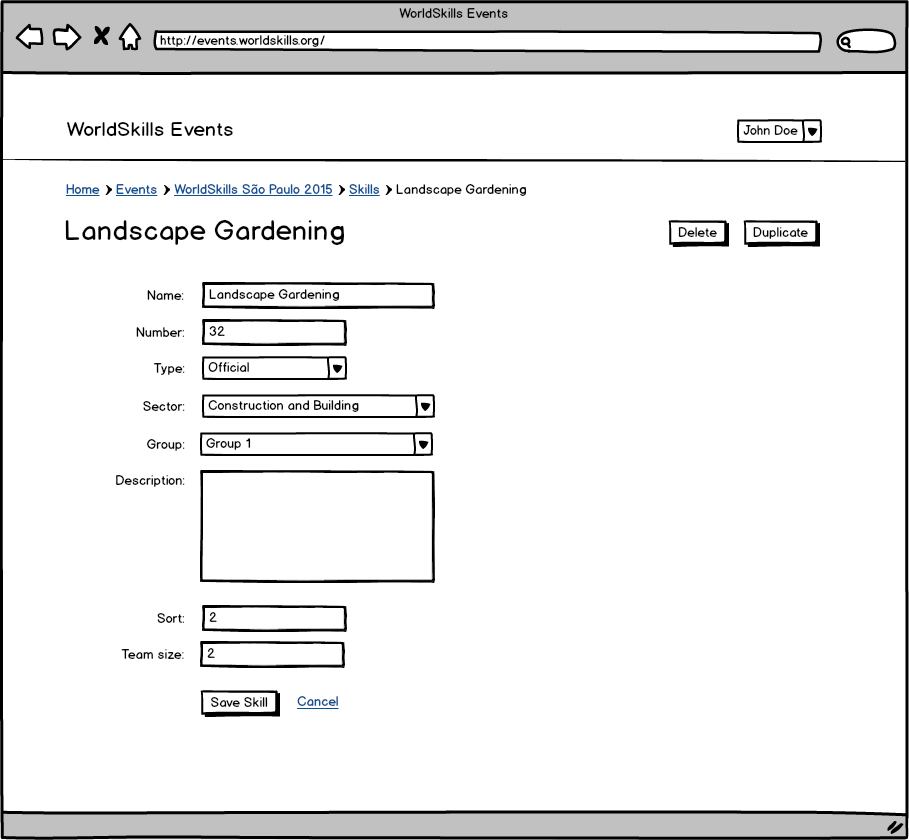

# Introduction

The WorldSkills Events application is used to manage all events related to WorldSkills. This includes Competitions, GAs, Champions Forums and regional events. It also used to manage Competition related information like Skills and sponsors.

# Events List

This is the first view and lists all events. The list can be filtered by name and date. New events can be added with the button “Add Event”.

# Event Detail

This view appears after clicking on an event in the Events List. All details of an event can be edited here. If the user selects the type “Competition” and saves the event, the Skills tab becomes visible. A event can also be duplicated with all the Skills and sponsors.

# Event Skills

Each Competition can have multiple Skills. This view lists all Skills of an event and let's the user add new ones.

# Event Skill Detail

After clicking a Skill in the Skills List the user can edit the details of a Skill. Each Skill has a type, describing wether it’s an Official Skill, a Demonstration Skill, a Presentation Skill or a Multi Skill. A Multi Skill is a ranking generated from multiple Skills.

# Event Sponsors

Each event also can have multiple sponsors. This view lists all sponsors of an event. New sponsors can be created with the button “Add Sponsor”.

# Event Sponsor Detail

The user can edit a sponsor with this view. A sponsor has a name and a logo and can optionally be linked to an organization.

